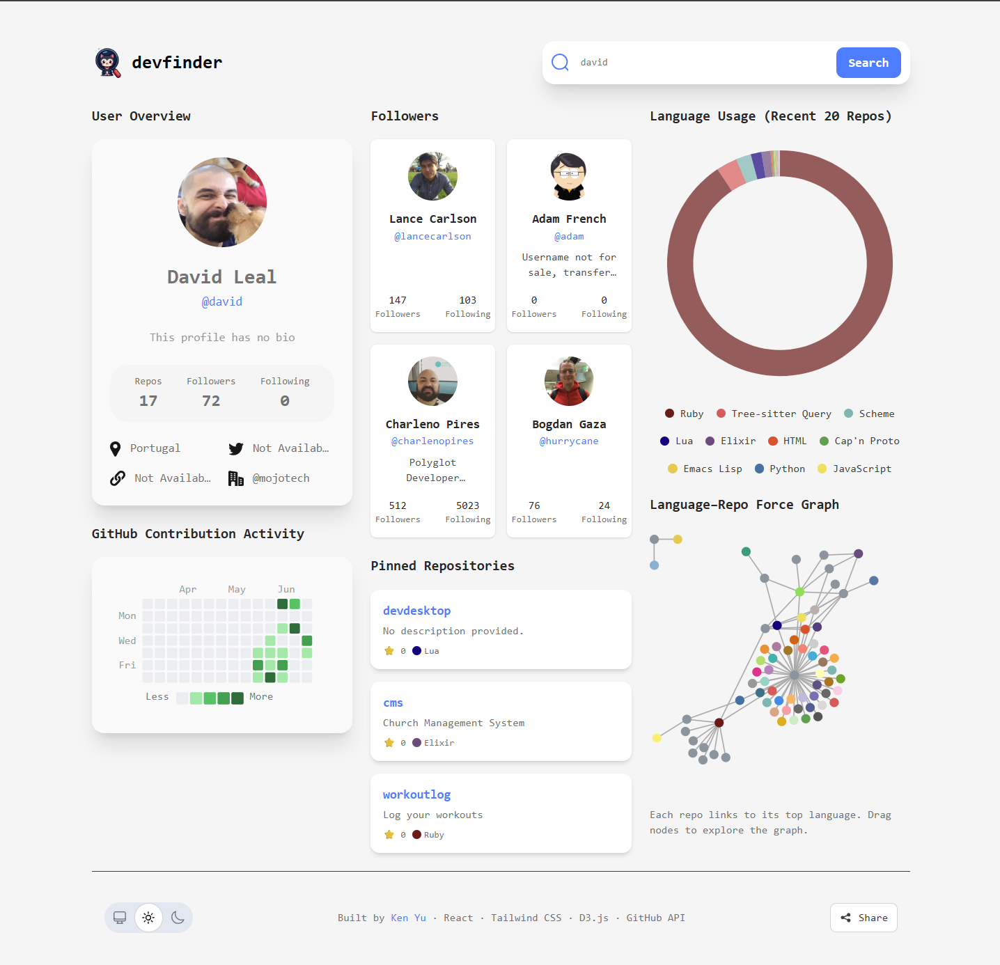
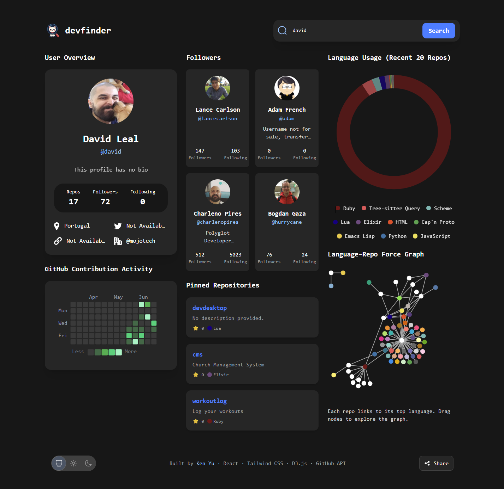

# devfinder

🔗 [Live Demo](https://github-user-search-app-liart-ten.vercel.app/)

A modern GitHub profile visualizer built with **React**, **Vite**, **Tailwind CSS**, and **D3.js**.  
Search for any GitHub user and explore their public data through clean, interactive visualizations: language usage, pinned repositories, contribution heatmap, and follower insights.

---

## 🔍 Features

- 🎨 Responsive UI with light/dark/system theme toggle
- 📈 Force-directed language–repo graph (D3.js)
- 🧱 GitHub-style contribution heatmap (3-month range)
- 📊 Language usage donut chart
- 📌 Pinned repositories and follower preview cards
- 🌐 Shareable permalink + modal

---

## 🛠 Tech Stack

- **React** + **Vite**
- **Tailwind CSS**
- **D3.js** for visualizations
- **GitHub REST API** for user + repo data
- Responsive layout via Tailwind’s utility-first system
- React Router DOM
- React Hot Toast for notification
- Vitest

---

## 🧪 Development

This template uses Vite’s default setup with hot module reloading:

```bash
npm install
npm run dev
```

testing

```bash
npx vitest --ui
```

## 🖼 Visuals

Light Mode

Dark Mode


## 🧾 Credits

Force-directed graph adapted from Mike Bostock’s Observable notebook.  
Original copyright © 2021 Observable, Inc. Licensed under the MIT License.

Partially inspired by [Maeve Kane’s fork of the Quaker network graph](https://observablehq.com/@mkane2/force-directed-graph-with-tooltip), which added dynamic tooltips and aesthetic improvements.

Contribution heatmap styled to resemble GitHub’s own

Original data and graph concept from the [Programming Historian Python network lesson](https://programminghistorian.org/en/lessons/creating-network-diagrams-from-historical-sources).

Logo and favicon generated using LogoMakr (used under free license with credit).

- Logo: https://app.logomakr.com/2xB8x8
- Favicon: https://app.logomakr.com/7Yyekz

Initial UI design inspiration from [Frontend Mentor](https://www.frontendmentor.io/challenges/github-user-search-app-Q09YOgaH6).

🧠 Special thanks to ChatGPT for helping me debug D3 and polish UX.

## 📝 License

This project’s source code is licensed under the [MIT License](https://opensource.org/licenses/MIT) — you are free to use or adapt it for learning or personal use.

> ⚠️ Note: The logo and favicon were generated using [LogoMakr](https://logomakr.com) under their **free license**, which requires attribution and **does not allow commercial use** without a paid license.
